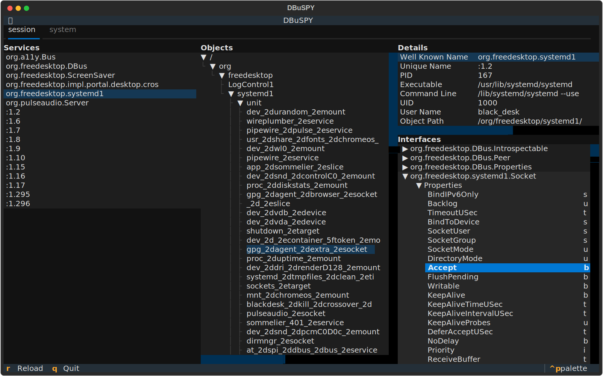
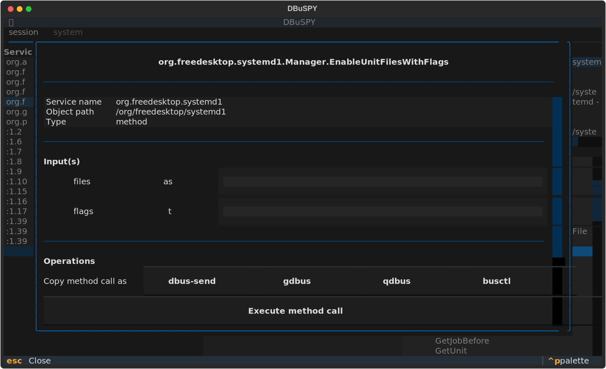

# DBuSPY


- ![license][badge-shields-io-license]
- ![checks][badge-shields-io-checks]
  [![codecov][badge-shields-io-codecov]][codecov]
- ![commit activity][badge-shields-io-commit-activity]
  ![contributors][badge-shields-io-contributors]
  ![release date][badge-shields-io-release-date]
  ![commits since release][badge-shields-io-commits-since-release]

[badge-shields-io-license]: https://img.shields.io/github/license/black-desk/DBuSPY
[badge-shields-io-checks]: https://img.shields.io/github/check-runs/black-desk/DBuSPY/master
[badge-go-report-card]: https://goreportcard.com/badge/github.com/black-desk/DBuSPY
[badge-shields-io-codecov]: https://codecov.io/github/black-desk/DBuSPY/graph/badge.svg?token=6TSVGQ4L9X
[codecov]: https://codecov.io/github/black-desk/DBuSPY
[badge-shields-io-commit-activity]: https://img.shields.io/github/commit-activity/w/black-desk/DBuSPY/master
[badge-shields-io-contributors]: https://img.shields.io/github/contributors/black-desk/DBuSPY
[badge-shields-io-release-date]: https://img.shields.io/github/release-date/black-desk/DBuSPY
[badge-shields-io-commits-since-release]: https://img.shields.io/github/commits-since/black-desk/DBuSPY/latest/master

`DBuSPY` is a pure python TUI program powered by [Textual][textual]
inspired by [D-Feet][d-feet],
which can use to inspect [D-Bus][d-bus] API.

[textual]: https://textual.textualize.io/
[d-feet]: https://wiki.gnome.org/Apps(2f)DFeet.html
[d-bus]: https://www.freedesktop.org/wiki/Software/dbus/

## Screenshots





## Install

> [!WARNING]
> This program is in very early stage and may break or change frequently!

### pipx

```bash
pipx install git+https://github.com/black-desk/DBuSPY
```

### pip

```bash
pip install git+https://github.com/black-desk/DBuSPY
```

## Development

This project use [poetry](https://python-poetry.org/).

### Install development dependencies

```bash
poetry install --with=dev
```

### Run application

```bash
poetry run -- dbuspy
```

### Log

Run application with [Textual development tools][textual-devtools] to check log.

[textual-devtools]: https://textual.textualize.io/guide/devtools/

First run:

```bash
poetry run -- textual console
```

Then in another shell:

```bash
poetry run -- textual run --dev dbuspy:DBuSPY
```

## Motivation

According to GNOME Wiki[^gnome-wiki],
my daily use D-Bus debugger [D-Feet][d-feet] is no longer maintained.

[^gnome-wiki]:
    > D-Feet is no longer maintained.

    [Source][d-feet]

As I quite often debug system services
like [Network Manager][network-manager] and [Systemd][systemd]
over SSH connection without GUI desktop session available,
a powerful TUI D-Bus debugger is needed.

[network-manager]: https://networkmanager.dev/
[systemd]: https://systemd.io/

## Project naming

[D(-)Bus][d-bus] + spy[^d-spy] + [py(thon)][python]

[^d-spy]:
    Inspired by [d-spy].

[python]: https://www.python.org/
[d-spy]: https://gitlab.gnome.org/GNOME/d-spy/

## Logo


This logo is a modified "only 'two snakes'" version [Python logo][python-logo],
with hats copied from [d-spy logo][d-spy-logo].

[python-logo]: https://www.python.org/community/logos/
[d-spy-logo]: https://gitlab.gnome.org/GNOME/d-spy/-/blob/f9aad10db09b57928f6bcfc09d6cfa06e5b64772/data/org.gnome.dspy.Source.svg

## Road map

- [x] Select D-Bus services
- [x] Select D-Bus object
- [x] Select D-Bus interfaces
- [x] List members under D-Bus interface
  - [x] Properties
  - [x] Methods
  - [x] Signals
  - [x] Annotations
    - [x] Interfaces
    - [x] Properties
    - [x] Methods
    - [x] Signals
- [ ] Perform D-Bus methods call
- [ ] Copy D-Bus methods call as
  - [ ] `dbus-send` command
  - [ ] `gdbus` command
  - [ ] `busctl` command
  - [ ] `qdbus` command
- [ ] Read D-Bus properties
- [ ] Copy D-Bus property read method call as
  - [ ] `dbus-send` command
  - [ ] `gdbus` command
  - [ ] `busctl` command
  - [ ] `qdbus` command
- [ ] Write D-Bus properties
- [ ] Copy D-Bus property write method call as
  - [ ] `dbus-send` command
  - [ ] `gdbus` command
  - [ ] `busctl` command
  - [ ] `qdbus` command
- [ ] Monitor D-Bus signals
- [ ] Monitor D-Bus properties change signal
- [ ] Monitor D-Bus method call
- [ ] Copy captured D-Bus method call as
  - [ ] `dbus-send` command
  - [ ] `gdbus` command
  - [ ] `busctl` command
  - [ ] `qdbus` command
